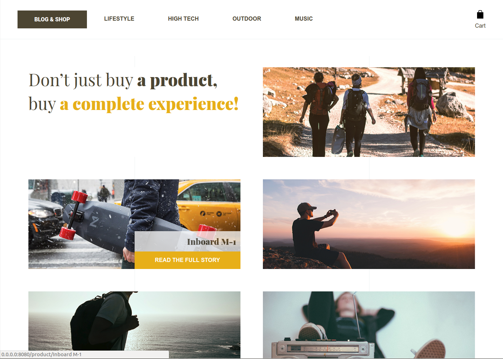
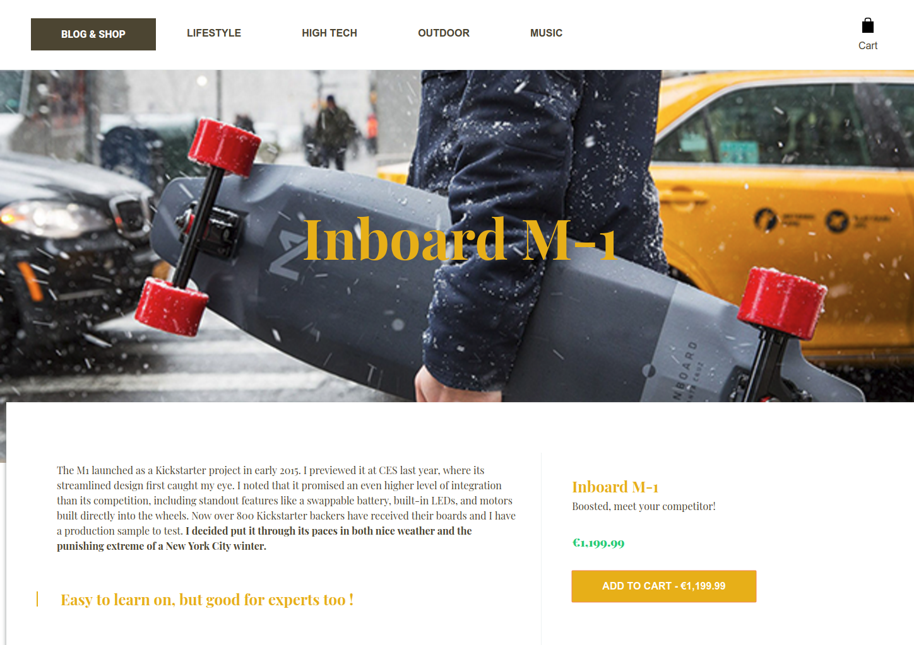

Front-Commerce Lite - Thème Blogshop
*Prototype your next eCommerce experiences using modern web technologies.*

Front-Commerce is a React application with a GraphQL middleware for building eCommerce stores backed by existing headless platforms such as Magento2. [Learn more about the product.](https://developers.front-commerce.com/)

## Theme Blogshop - Overview
Our Blogshop theme aims to propose a user-centered representation of ecommerce. Nowadays, users want feedbacks and reviews about products they’re buying. They don’t follow the old marketing approach anymore. You have to convince them by giving them human feedbacks.

In our Blogshop theme, we’re giving a core place to the product description. With the power of storytelling, we can create awesome product stories, as you can see on the screenshot down below.

## Installation instructions
[See Front-Commerce Lite general setup guide](https://github.com/front-commerce/front-commerce-lite/blob/master/README.md)

## Going in production
Convinced that Front-Commerce Lite’s stack is viable enough for your project? If yes, we achieved our goal!

You now have several solutions:

* start a project from scratch using these technologies. If your needs are simple it could be a solution, otherwise prepare yourself to months of work!
* compare with existing alternatives and choose the one which fits your needs and budget: features, architecture, test coverage and (if they are open source) the quality of their codebase
* fork Front-Commerce Lite in the open, follow our philosophy and architecture… and name it React Storefront :slightly_smiling_face:
* use Front-Commerce and start developing your features on top of a production ready solution right now!

:email: Contact our team to get further information and contract a Front-Commerce license.

## License
MIT